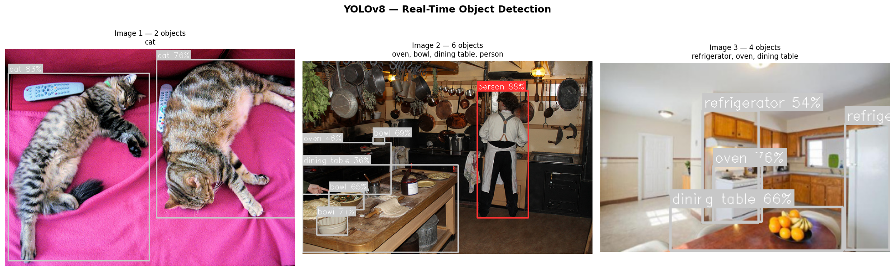
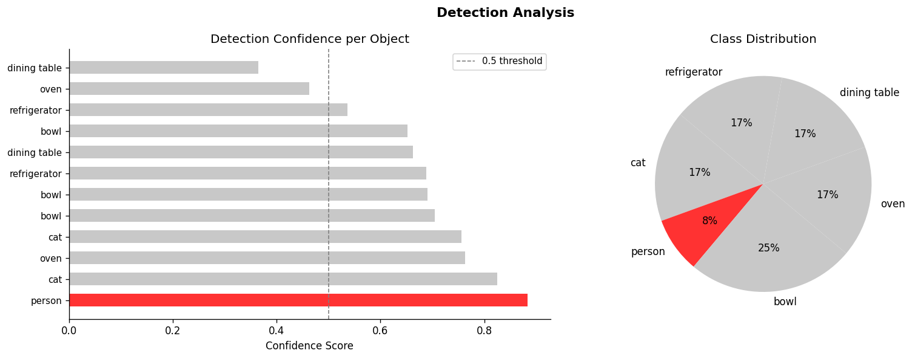

# 👁️ Real-Time Object Detection Robot Vision

> YOLOv8 + OpenCV based object detection system for robots.
> Detects humans, cars, and obstacles in real-time.

[](https://colab.research.google.com/github/kashan-ikram/machine-vision-object-detection/blob/main/object_detection.ipynb)
[]()
[]()
[]()
[]()

---

## 📸 Results

### Object Detection Output


### Confidence & Class Analysis


---

## 🧠 How It Works

```
Input: Image / Video frame
         ↓
YOLOv8n (pre-trained on COCO — 80 classes)
         ↓
Bounding boxes + confidence scores
         ↓
Priority classification
         ↓
Human 🧑  Car 🚗  Obstacle 📦
```

---

## 🎯 Detected Classes (Robot-Relevant)

| Class | Emoji | Priority |
|---|---|---|
| Person | 🧑 Human | 🔴 HIGH |
| Car | 🚗 Car | 🟡 MED |
| Truck | 🚛 Truck | 🟡 MED |
| Bus | 🚌 Bus | 🟡 MED |
| Motorcycle | 🏍️ Moto | 🟡 MED |
| Stop Sign | 🛑 Sign | 🟢 LOW |
| Chair/Couch | 🪑 Obstacle | 🟢 LOW |

---

## ⚙️ Tech Stack

| Tool | Use |
|---|---|
| YOLOv8 (Ultralytics) | Object detection model |
| OpenCV | Image processing |
| Matplotlib | Visualization |
| COCO Dataset | Pre-trained weights |

---

## 🚀 Quick Start

1. Click **Open in Colab** badge
2. `Runtime → Run all`
3. Cell 7 mein apni image upload karo

---

## 📁 Project Structure

```
machine-vision-object-detection/
├── object_detection.ipynb
├── images/
│   ├── detection_results.png
│   └── analysis_chart.png
└── README.md
```

---

**Author: Kashan Ikram**
[](https://github.com/kashan-ikram)
